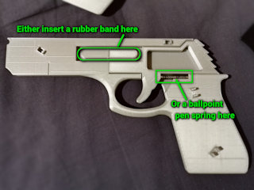

# Rubber Band Gun remix² 5 shots
*5-shot semi-automatic rubber band gun (formerly thing:3985409)*

### License
[Creative Commons - Attribution - Share Alike](https://creativecommons.org/licenses/by-sa/4.0/)

### Attribution

This is an evolution of the rubber band gun that started out as the *step-up-action* wooden gun by [RBGuns](https://www.rbguns.com/), which was made available on Thingiverse as [a laser-cut design by ddanijell](https://www.thingiverse.com/thing:848581). This was later on remixed as [a 3D printable design by thecrash74](https://www.thingiverse.com/thing:931909), and then improved by [iClint](https://www.thingiverse.com/thing:1666305).

### Gallery

[🔎](images/rubbergun1.jpg) [🔎](images/rubbergun2.jpg) [🔎](images/rubbergun3.jpg)

## Description and Instructions

This version of this toy has the following improvements compared to the models it is based on:
- 5 shot capacity instead of 3.
- Larger design suitable for number 18 rubber bands, and also better fits adult hands.
- Can use either a typical 1 inch ballpoint spring for the trigger, or a rubber band.
- Reliable mechanism with reduced risk of bands getting snagged.
- Easy printing and assembly, using clips that do not rely on perfect tolerances (no screws, glue, nor dowels).
- Some extra styling inspired by the 1911.

This is about the simplest semi-automatic rubber band gun design possible with only one moving part, which makes it both reliable and easy to set up. [See it in action here.](https://youtu.be/ElJUnlLW0RQ)

### Printing

Do not print this as one of your first 3D prints after buying a 3D printer! You must have some experience with your printer and be able to print accurately.

For this to assemble correctly, the thickness of the parts is important. It must be close to what the 3D models specify:
- the **center** part should be **6.0 mm** thick,
- the **trigger 5.6 mm**,
- the **sides and grips 3.0 mm**.

It is OK if your printed parts deviate from these values by ±0.1 mm, but not more. If you do not have a caliper or micrometer to verify the thickness, buy one: it is pretty much an essential tool for 3D printing.

The recommended layer height is **0.2 mm** for the center part, trigger, and clips. The rest is best printed at **0.1 mm.** You could print everything at 0.2, but then there are only 3 layers to cover the holes for the clips, and this could result in scars or holes in the surface. Again, if you know your printer well, you should know what it can handle. When unsure, print the sides and grips at 0.1 mm.

Infill doesn't matter much. I used 15%.

The flatter the bottom and top surfaces, the easier to assemble, and the better the assembled toy will look. Do not print on a worn-out bubbly print bed, replace the surface if necessary. To get a nice flat top surface, use enough top layers (at least 4) and a narrow extrusion width for the final layer. This is especially important for the trigger part.

‘Shorter’ and ‘longer’ variations on the clips are provided to allow assembling even if the thicknesses are not exact. Since these clips are tiny anyway, it is best to just print all variations at once and then use the ones that fit best.

### Assembly

To assemble, start by pushing the two **smallest clips** (H shaped) into the two holes at the **upper side** of the middle part (the “slide”), then attach the right side by pushing it into the clips. Then insert the trigger and add either a rubber band or a 1 inch (25 mm) ballpoint pen spring (maximum outer diameter 5 mm) for tension. Then push the left side into the clips, insert the **largest clips** (with two connecting rods) in the **grip,** and finally attach the grip panels.

[🔎](images/rubbergun-assembly1.png) [🔎](images/rubbergun-assembly2.jpg)

Should the clips not catch because your printed parts are slightly too thick, either try to sand down any irregularities, or use the ‘longer’ clips. Conversely, if the clips are too loose, try again with the ‘shorter’ clips. If none of the clip variants catch well, slightly scale up the clip models **in the X direction only** and try again.

If the trigger does not move smoothly, it is most likely due to roughness of the top and/or bottom surfaces. Again, the flatter your printer's bed surface, the better. A bit of sanding of the trigger piece and if necessary the side pieces, can help to remedy this.

## Using

This has been tested with **number 18** rubber bands (1.6mm or 1/16 inch thick and about 76 mm or 3 inches long when new). Shorter bands down to size 14 may work as well, but the trigger pull could become really hard with 5 of those loaded. From a quick comparison, it seems shorter bands hit harder at short distances, but due to their lower mass they will lose their momentum sooner and will not go farther than the longer ones.

[🔎](images/rubbergun-loading.jpg)

Rubber bands must be loaded in the reverse order in which they will be launched: **start at the lowest notch.** Otherwise they will get tangled because the first band to be launched will be covered by others. For straight shots, maintain equal tension at the left and right sides of the rubber bands while mounting them. Do not load new bands before all the previous ones have been shot, or again there is a risk of causing a tangle.

When firing, pull the trigger all the way back to ensure correct cycling of the bands.

For maximum reliability even when shooting rapidly, apply a little grease or oil to the two topmost notches of both the frame and the ‘hammer’. This will ensure the bands slide upwards quickly and makes it possible to quick-fire all 5 bands in one second.

### Common sense reminder

Depending on how you print this, this may look like a real gun from afar. Don't do stupid things. Also do not shoot rubber bands towards living beings' eyes at close range. This design comes without any warranties or liabilities, use at your own risk.

## Licensing notice

This is released under a *[Creative Commons - Attribution - Share Alike](http://creativecommons.org/licenses/by-sa/3.0/)* license. As far as I am concerned, you may sell printed copies, even without explicitly asking permission, at the condition that you honor the license. In a nutshell:
- Each sold copy must include a visible reference and link to this Thing page, for instance a printout of the attribution cards provided as PDF in this repository.
- On any online store page where you sell this, there must also be a visible link to this GitHub page.
- The Share Alike part of the license means that you must publish the model files for any variations you make on this model, and they must be published under the same or a compatible license.

For more details about my interpretation of the CC BY-SA license, see the [licensing section of the Flexi Rex repository](https://github.com/DrLex0/print3D-FlexiRex#license-clarification-read-this-before-contacting-me).

Because this is based on a design by [RBGuns.com](https://www.rbguns.com/) however, additional licensing may need to be obtained from them if you want to sell this for profit.

## How I designed this

It seemed trivial to simply take the original design and increase the number of notches, but this proved a bit naïve. Modifying the angles and moving notches higher up, increased the risk of the bands getting snagged. The material I was using also had very high friction and this made the upper bands reluctant to crawl upwards, especially when carelessly trying to add sloped surfaces in the hopes of solving the snagging problem. In the end I added specific chamfers to remove any points on which the bands could get stuck, and I changed the slope of the topmost surfaces. I printed increasingly minimal versions of the side panels to test designs until I had something that works reliably.

[🔎](images/rubbergun-junk.jpg)

This is not the first 5-shot upgrade to this design. Only weeks after uploading this, I found out that others ([1](https://www.thingiverse.com/thing:296960), [2](https://www.thingiverse.com/thing:2701321)) had done it before, but I didn't find them earlier due to the terrible unreliability of Thingiverse's search system. This version however, has extra refinements that should improve reliability, and of course the extra styling.

## Updates

### 2019/11/20
First published on Thingiverse.

### 2019/12/28
Small tweaks: made the recess for loading bands larger, and made the difference between the shorter and longer clips more prominent.

### 2022/12/11
Migrated to GitHub.

## TAGS

`band`, `elastic`, `pistol`, `rubber`, `rubber_band`, `rubber_band_gun`, `semi-automatic`, `toy`
